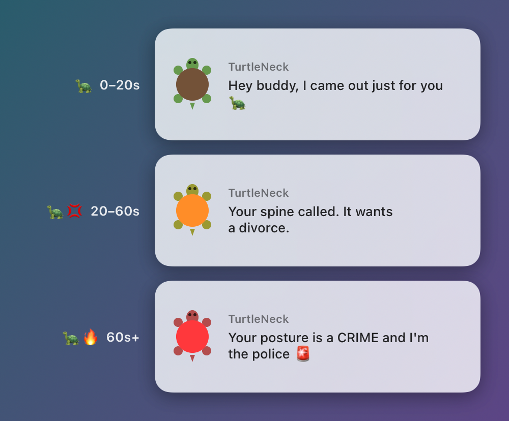

<div align="center">

# 🐢 TurtleNeck

**거북목을 고쳐주는 잔소리꾼 거북이**

자세가 무너지면 거북이가 화면에 슬며시 나타나고,<br>
계속 구부정하면 점점 화를 냅니다.

[](https://www.apple.com/macos/)
[](Windows/README.md)
[](LICENSE)
[](https://ko-fi.com/kpryu)

[English](README.md) · **한국어**



</div>

---

## 설치 (macOS)

```bash
curl -fsSL https://raw.githubusercontent.com/kpryu6/turtleneck/main/install.sh | bash
```

Homebrew가 있으면 Homebrew로 설치하고, 없으면 [Releases](https://github.com/kpryu6/turtleneck/releases)에서 앱을 바로 내려받아요. 처음 실행하면 카메라 권한을 허용하고 5초 동안 바른 자세로 앉아 기준 자세를 저장하면 끝이에요.

<details>
<summary>다른 설치 방법</summary>

**Homebrew**
```bash
brew tap kpryu6/turtleneck
brew install --cask turtleneck
xattr -cr /Applications/TurtleNeck.app
```

**DMG**

1. [Releases](https://github.com/kpryu6/turtleneck/releases)에서 `.dmg`를 받아 TurtleNeck을 응용 프로그램 폴더로 끌어다 놓으세요.
2. 앱을 여세요. 아직 Apple 공증을 받지 않은 앱이라 처음에는 macOS가 실행을 막아요.
3. **시스템 설정 → 개인정보 보호 및 보안**에서 **그래도 열기**를 누르세요. 터미널에서 `xattr -cr /Applications/TurtleNeck.app`를 실행해도 돼요.

</details>

### Windows (베타)

Windows 버전은 아직 macOS 버전을 따라가는 중이에요. 되는 기능과 설치 방법은 [Windows/README.md](Windows/README.md)를 보세요.

## 동작 방식

1. **기준 자세 저장.** 바르게 앉은 자세를 기준으로 저장해요.
2. **감지.** 1초에 한 번 웹캠 화면 속 얼굴 위치를 확인해요. 분석은 Mac 안에서 Apple Vision으로 해요.
3. **알림.** 머리가 내려가거나 화면 쪽으로 다가간 상태가 5초 넘게 이어지면 거북이가 나타나요.
4. **단계 상승.** 오래 구부정할수록 거북이가 점점 화를 내요.

| | 단계 | 구부정한 시간 | 예시 |
|---|-------|---------|---------|
| 🐢 | 부드럽게 | 0–20초 | *"Hey buddy, I came out just for you"* |
| 🐢💢 | 짜증 | 20–60초 | *"Your spine called. It wants a divorce."* |
| 🐢🔥 | 분노 | 60초+ | *"Your posture is a CRIME and I'm the police 🚨"* |

## 기능

- **메뉴 막대 앱.** 자세가 나빠지면 거북이 아이콘이 노랑, 빨강으로 바뀌어요.
- **나만의 메시지와 캐릭터.** 잔소리 문구를 직접 쓰거나, 거북이를 고양이·강아지·부엉이 또는 내 사진으로 바꿀 수 있어요.
- **통계.** 일별 점수, 거북이 등장 횟수, 주간 추이, GitHub 잔디 같은 연간 캘린더, 🔥 연속 기록을 보여줘요.
- **휴식 알림.** 뽀모도로 방식의 작업/휴식 타이머예요.
- **방해하지 않기.** 근무 시간에만 켜거나, 특정 앱을 쓰는 동안이나 집중 모드일 때 쉬게 할 수 있어요.
- **8개 언어.** 한국어, English, 日本語, 中文, Español, Deutsch, Français, Português.

## 개인정보

모든 처리는 Mac 안에서만 이뤄져요. **카메라 영상은 녹화하지도, 저장하지도, 어디로 보내지도 않아요.** 서버도, 분석 도구도, 계정도 없어요. 기준 자세와 비교하기 위한 얼굴 위치와 크기만 기억해요.

## 자주 묻는 질문

**배터리를 많이 먹나요?**
그렇지 않아요. 카메라는 켜져 있지만 분석은 1초에 한 프레임만 해요. 메뉴 막대에서 **일시정지**를 누르면 카메라가 완전히 꺼져요.

**카메라 불이 계속 켜져 있어요.**
자세를 보려면 카메라가 필요해요. 일시정지하거나 앱을 끄면 불도 꺼져요.

**바르게 앉아도 계속 경고가 떠요.**
메뉴 막대의 **캘리브레이션**에서 평소 앉는 자리 그대로 다시 기준을 잡거나, 설정에서 **민감도**를 Loose로 바꿔보세요. 노트북이나 모니터 위치를 옮겼다면 다시 캘리브레이션하는 게 가장 효과적이에요.

**집중 모드 중 일시정지가 안 돼요.**
macOS는 집중 모드 상태를 보호된 위치에 저장해요. **시스템 설정 → 개인정보 보호 및 보안**에서 TurtleNeck에 전체 디스크 접근 권한을 줘야 읽을 수 있고, 권한이 없으면 이 옵션은 동작하지 않아요.

**삭제는 어떻게 하나요?**
```bash
brew uninstall --cask --zap turtleneck   # Homebrew로 설치했다면
rm -rf /Applications/TurtleNeck.app      # 그 외
defaults delete com.turtleneck.app       # 설정과 통계까지 지우기
```

## 소스에서 빌드하기

Xcode 15 이상이 필요해요.

```bash
brew install xcodegen
git clone https://github.com/kpryu6/turtleneck.git
cd turtleneck
xcodegen generate
xcodebuild -project TurtleNeck.xcodeproj -scheme TurtleNeck build
```

버그 제보, 아이디어, 새로운 잔소리 문구 모두 [Issues](https://github.com/kpryu6/turtleneck/issues)에 남겨주세요.

## 후원

TurtleNeck은 **무료 오픈소스**예요. 목이 좀 편해졌다면 거북이에게 커피 한 잔 사주세요.

<a href="https://ko-fi.com/kpryu"></a>

## 라이선스

[MIT](LICENSE)

---

<div align="center">
<sub>목은 고마워할 거예요. 거북이는 아니겠지만요. 🐢</sub>
</div>
