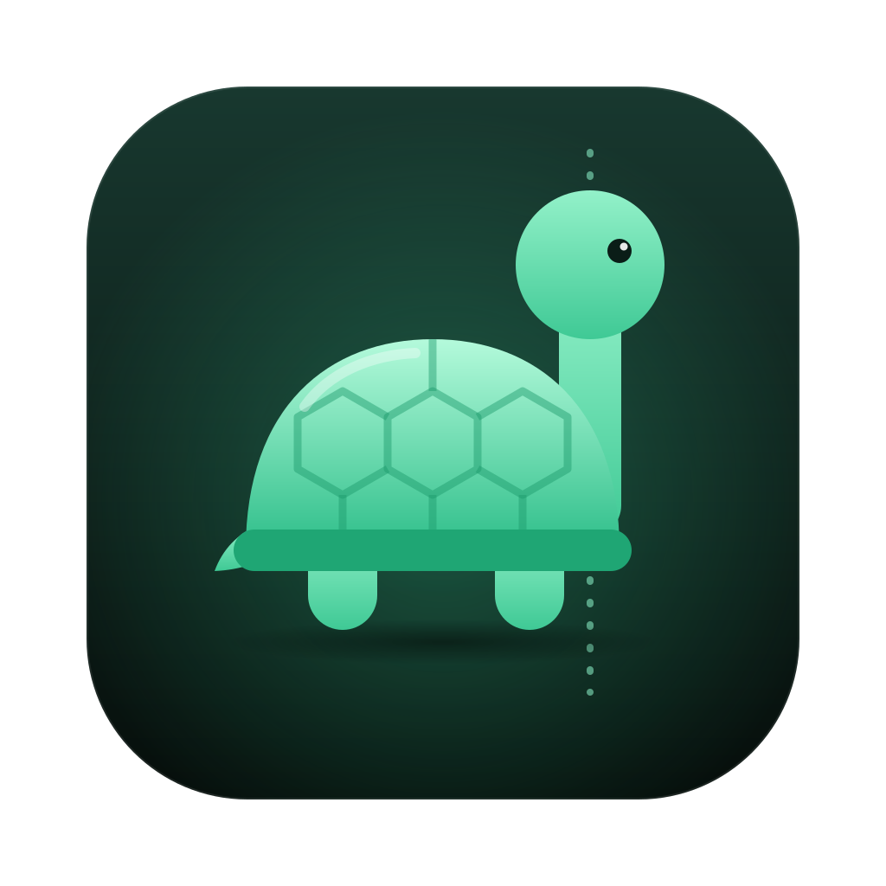

<div align="center">



# TurtleNeck

**A sassy turtle that fixes your posture**

Slouch at your desk and a turtle slides onto your screen.<br>
Keep slouching and it gets angrier.

[](https://www.apple.com/macos/)
[](Windows/README.md)
[](LICENSE)
[](https://ko-fi.com/kpryu)

**[Website](https://kpryu6.github.io/turtleneck/)** · **English** · [한국어](README.ko.md)


</div>

---

## Install (macOS)

```bash
curl -fsSL https://raw.githubusercontent.com/kpryu6/turtleneck/main/install.sh | bash
```

That's it. It downloads the latest version from [Releases](https://github.com/kpryu6/turtleneck/releases), installs it to Applications, and opens it (no Homebrew needed). Run the same command again to update. On first launch, allow camera access and sit up straight for 5 seconds to calibrate.

<details>
<summary>Other ways to install</summary>

**Homebrew**
```bash
brew tap kpryu6/turtleneck
brew trust kpryu6/turtleneck
brew install --cask turtleneck
xattr -cr /Applications/TurtleNeck.app
```

**DMG**

1. Download the `.dmg` from [Releases](https://github.com/kpryu6/turtleneck/releases) and drag TurtleNeck into Applications.
2. Open it. macOS will block it the first time because the app is not notarized yet.
3. Go to **System Settings → Privacy & Security** and click **Open Anyway**. You can also run `xattr -cr /Applications/TurtleNeck.app` instead.

</details>

### Windows (beta)

**[Download TurtleNeck-Setup.exe](https://github.com/kpryu6/turtleneck/releases/latest/download/TurtleNeck-Setup.exe)** and run it. It installs for your user only (no admin rights needed), and you can uninstall it from **Settings → Apps**.

Or in PowerShell:

```powershell
irm https://raw.githubusercontent.com/kpryu6/turtleneck/main/install.ps1 | iex
```

Windows SmartScreen may warn because the app isn't code-signed yet: choose **More info → Run anyway**. The Windows version doesn't have every macOS feature yet; see [Windows/README.md](Windows/README.md) for what works.

## How it works

1. **Calibrate.** Sit up straight, and TurtleNeck saves that position as your baseline.
2. **Monitor.** Once a second, it checks where your face sits in the webcam frame (Apple Vision, on your Mac).
3. **Alert.** If your head drops or moves toward the screen for 5+ seconds, the turtle slides in.
4. **Escalate.** The longer you slouch, the angrier it gets.

| | Level | Slouching for | Example |
|---|-------|---------|---------|
| 🐢 | Gentle | 0–20s | *"Hey buddy, I came out just for you"* |
| 🐢💢 | Annoyed | 20–60s | *"Your spine called. It wants a divorce."* |
| 🐢🔥 | Angry | 60s+ | *"Your posture is a CRIME and I'm the police 🚨"* |

## Features

- **Menu bar app.** The turtle icon turns yellow or red as your posture gets worse.
- **Your own messages and characters.** Write your own sassy lines, or swap the turtle for a cat, dog, owl, or your own image.
- **Stats.** Daily score, turtle visits, weekly trend, a GitHub-style year calendar, and 🔥 streaks. A day with a score of 70+ extends your streak, and days you don't use TurtleNeck (like weekends) don't break it.
- **Break reminder.** A Pomodoro-style work/rest timer that remembers your settings.
- **Stays out of the way.** Runs only during work hours if you want, pauses while chosen apps are open, and pauses during Focus mode.
- **8 languages.** English, 한국어, 日本語, 中文, Español, Deutsch, Français, Português.

## Privacy

Everything runs locally on your Mac. **No camera footage is recorded, stored, or sent anywhere.** There are no servers, no analytics, and no accounts. TurtleNeck only keeps the position and size of your face to compare against your baseline.

## Verify your download

Every release is built from this repository by GitHub Actions and carries signed [build provenance](https://docs.github.com/actions/security-for-github-actions/using-artifact-attestations). To check that a file really came from here:

```bash
gh attestation verify TurtleNeck.dmg --repo kpryu6/turtleneck
```

## FAQ

**Does it drain my battery?**
It shouldn't. The camera stays on, but TurtleNeck analyzes only one frame per second. Choose **Pause** in the menu bar to turn the camera off completely.

**Why is my camera light on?**
TurtleNeck needs the camera to see your posture. The light goes off when you pause or quit.

**It keeps warning me even when I sit straight.**
Open **Calibration** from the menu bar and recalibrate in your usual seat, or set **Sensitivity** to Loose in Settings. Calibrating again after you move your laptop or monitor helps a lot.

**Pause during Focus doesn't work.**
macOS keeps Focus status in a protected location. TurtleNeck can only read it if you give it Full Disk Access in **System Settings → Privacy & Security**. Without that access, the option has no effect.

**How do I uninstall it?**
```bash
brew uninstall --cask --zap turtleneck   # if installed with Homebrew
rm -rf /Applications/TurtleNeck.app      # otherwise
defaults delete com.turtleneck.app       # remove settings and stats
```

## Building from source

Requires Xcode 15+.

```bash
brew install xcodegen
git clone https://github.com/kpryu6/turtleneck.git
cd turtleneck
xcodegen generate
xcodebuild -project TurtleNeck.xcodeproj -scheme TurtleNeck build
```

| Component | Technology |
|-----------|-----------|
| UI | Swift 5.9 + SwiftUI, AppKit menu bar (`NSStatusItem`) |
| Posture detection | Apple Vision (face landmarks) + AVFoundation |
| Alerts | Custom slide-in `NSPanel` |
| Charts | Swift Charts |
| Project | XcodeGen |

Bug reports, ideas, and new sassy messages are all welcome in [Issues](https://github.com/kpryu6/turtleneck/issues).

## Support

TurtleNeck is **free and open source**. If it saved your neck, you can buy the turtle a coffee:

<a href="https://ko-fi.com/kpryu"></a>

## License

[MIT](LICENSE)

---

<div align="center">
<sub>Your neck will thank you. The turtle won't. 🐢</sub>
</div>
